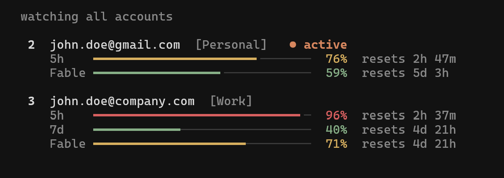

# ccshift

Multi-account switcher for Claude Code. Easily switch between multiple Claude accounts without logging out, or let it switch for you before you hit a rate limit. Track usage for every account in a live dashboard, and run accounts in parallel. Works with both the Claude Code CLI and the VS Code extension.

ccshift is a fork of [realiti4/claude-swap](https://github.com/realiti4/claude-swap)
(commit `3a4e5c1`, v0.27.0b1), renamed end to end: the command, the Python
package, the data directory (`~/.ccshift`) and the Keychain service (`ccshift`).
It never reads or changes a `claude-swap` install or its `~/.claude-swap-backup`
store. This repository also contains a native macOS menu bar app in
[`apps/menubar`](apps/menubar).

## Installation

ccshift is not published on PyPI. Install it from this repository:

```bash
uv tool install git+https://github.com/nam-sequence/ccshift
```

### From source

```bash
git clone https://github.com/nam-sequence/ccshift.git
cd ccshift
uv sync
uv run ccshift help
```

### Updating

```bash
ccshift upgrade          # auto-detects the uv tool install and upgrades it
# or run uv directly:
uv tool upgrade ccshift
```

### Migrating from cc-swaper (`ccs`)

Earlier versions of this repository shipped `cc-swaper` (the `ccs` command,
its profiles and a zsh `claude()` wrapper). ccshift does not read any of that
data. To remove it, quit every Claude Code session started through `ccs`, open
a new Terminal and run from a checkout of this repository
(`git clone https://github.com/nam-sequence/ccshift.git && cd ccshift`):

```bash
bash scripts/remove-cc-swaper.sh           # dry run: lists what would be removed
bash scripts/remove-cc-swaper.sh --apply   # remove it
```

The script refuses to delete anything while a process still uses the old data
and lists those processes. Quit them, or add `--kill-running` to stop them.

This removes the ccs profiles and their Keychain logins, the zsh wrapper
(`~/.zshrc` is backed up first), the `cc-swaper` uv tool, the old menu bar app
and a leftover `~/.claude-swap-backup` store. Your default Claude Code login
and history (`~/.claude`) are kept. Add `--keep-history-backup` to keep the
session-history copy that ccs saved under `~/.config/cc-swaper/session-backups`.
Then add your accounts again with `ccshift add`.

## Usage

### Add your first account

Log into Claude Code with your first account, then:

```bash
ccshift add
```

### Add more accounts

Sign in to the other account with your browser, without changing the account Claude Code is using:

```bash
ccshift add --login                        # Claude sign-in page
ccshift add --login --sso --email me@company.com  # single sign-on, email pre-filled
```

This runs Claude Code's own `claude auth login` in a separate, temporary profile, saves that account, then deletes the temporary profile. If your browser is already signed in to a different Claude account, add `--private` to open the sign-in page in a private window: the default browser when it supports one from the command line (Chrome, Brave, Edge, Firefox, Vivaldi, Opera), otherwise the first installed browser that does, or pick one with `--browser com.google.Chrome`. Safari and Arc cannot open a private window for another app; the menu bar app's own private sign-in window works with any browser.

Or log in with the other account in Claude Code, then:

```bash
ccshift add
```

Do not run `/logout` first: current Claude Code may revoke the refresh token stored for the account you are leaving.

### Switch accounts

Rotate to the next account:

```bash
ccshift switch
```

Or switch to a specific account:

```bash
ccshift switch 2
ccshift switch user@example.com
ccshift switch dev                # or by alias, once set with `ccshift alias 2 dev`
```

Not sure which one? `ccshift list` is the dashboard — every account's 5-hour and 7-day usage and reset times at a glance:

```bash
ccshift list
```

Or let ccshift auto-pick by remaining quota — `ccshift switch --strategy best` (most quota left) or `--strategy next-available` (skip rate-limited accounts).

**Note:** You usually don't need to restart — on Linux/Windows the new account is picked up automatically, and on macOS after the Keychain cache expires. To apply it instantly, restart Claude Code or reopen the VS Code extension tab. See [Tips](#tips) for the per-platform details.

### Automatic switching

Let ccshift watch your usage and switch for you. When the active account's 5-hour or 7-day window reaches the threshold (default 90%), it switches to the account with the most quota left — before you hit the limit, and safe to run while Claude Code is working:

```bash
ccshift auto                     # foreground loop, polls every 60s
ccshift auto --threshold 80      # switch earlier
ccshift auto --model Fable       # also switch when the Fable weekly limit is hit
ccshift auto --once              # single check-and-switch, for cron/scripts
ccshift auto --dry-run           # log what it would do, never switch
ccshift auto --strategy consume-first   # burn the soonest-resetting account first
```

<details>
<summary>How it behaves & advanced usage</summary>

- Runs safely alongside Claude Code: switches take the same credential locks Claude Code uses, so a swap never collides with a token refresh.
- A cooldown (default 5 min) and a hysteresis margin stop it flip-flopping near the threshold: a proactive switch only lands on an account that's below the threshold *and* better than the current one by the margin — a candidate that clears the margin is always taken, but two accounts hovering at the line never ping-pong. When every account is exhausted it keeps checking on a bounded slow cadence, waking sooner for an imminent reset.
- **Strategies** (`--strategy`, or `ccshift config set autoswitch.strategy`): `best` (default) stays put until the active account nears its limit, then moves to the account with the most quota left. `consume-first` proactively keeps you on the account whose **weekly window resets soonest** — use-it-or-lose-it — switching to a sooner-resetting account (with room to spare) even below the threshold, so perishable weekly quota isn't wasted.
- Usage polling is adaptive — a couple of accounts per check, busy alternates watched more closely, and exhausted ones checked about every ten minutes (or slower after 429s) — so API traffic stays flat no matter how many accounts you manage.
- It fails safe: if a usage check errors it keeps trusting the last-known numbers while retries back off, and an expired token on an idle machine makes it hold rather than fail over (Claude Code refreshes the token on your next message).
- An account whose refresh token has died is quarantined and reported until you either log in with it and re-run `ccshift add --slot N`, or replace its stored credentials from a known-good export — a plain `ccshift import backup.ccshift` replaces dead-token slots on its own (`--force` is still required to replace other existing accounts; note a stale export can carry an already-superseded token). API-key accounts are never rotated onto unless you pass `--include-api-key-accounts`.
- To hold an account out of rotation yourself — a work account you don't want touched, one you're resting — run `ccshift disable <num|email>`; `ccshift enable <num|email>` puts it back. Disabled accounts are skipped by auto-switch, bare `ccshift switch`, and the `best` / `next-available` strategies, but stay fully managed and remain a valid explicit `ccshift switch <num|email>` target. They show a `(disabled)` marker in `ccshift list`, in the [TUI](#interactive-dashboard-tui), and in the [menu bar](#menu-bar-macos) — both of which also let you toggle the state in place (TUI: menu → *Disable / enable account…*; menu bar: *Disable / enable account*).
- By default only the account-wide 5h/7d windows drive switching. If you work on one model and hit its **weekly per-model limit** first (e.g. Fable), add `--model Fable` (or `ccshift config set autoswitch.model Fable`) to fold that model's window into the decision, so it switches off an account whose model quota is spent even while its 5h/7d windows still have room.
  - **Model names** are Anthropic's own per-model `display_name`s, matched case-insensitively. The exact strings for your accounts are the per-model rows in `ccshift list` (e.g. a line reading `Fable: 100%`).

For cron/systemd timers, `--once` reports the outcome in its exit code (`0` switched, `1` error, `2` nothing to do, `3` blocked — no viable target), and `--json` emits one JSON event per line:

```bash
*/5 * * * * ccshift auto --once --json >> ~/.ccshift-auto.log 2>&1
```

Defaults like the threshold and cooldown are configurable with `ccshift config set autoswitch.threshold 80` — flags override them (see [Configuration](#configuration)).

</details>

### Run multiple accounts at the same time (session mode)

Launch Claude Code as a specific account in the current terminal only — every other terminal and the VS Code extension stay on your default account, so two accounts can work in parallel.

```bash
ccshift run 2                     # launch Claude Code as account 2, here only
ccshift run user@example.com      # by email
ccshift run 2 -- --resume         # everything after '--' is forwarded to claude
ccshift run 2 --share-history     # share your chat history with this account too
ccshift run 2 --require-session   # refuse rather than run plain claude if 2 is the default login
```

Sessions use your normal `~/.claude` setup (settings, CLAUDE.md, skills, MCP servers, etc.), but each account keeps its own chat history — pass `--share-history` if you want your accounts to continue the same conversations.

Running the account that is already your default login launches plain `claude` on that login instead of a session (a second copy of the active credential would go stale). Scripts that need the isolation guaranteed can pass `--require-session`, which refuses in that case instead.
  
A session refreshes its own copy of the account's token, so once it exits, the credential it rotated is captured back into the account's stored backup before a switch or usage check uses that backup. While a session is still running, `ccshift switch` refuses to move the default login onto its account if the stored backup has already fallen behind (activating it could only fail); exit the session first, or pick another account. While a session runs, its account's usage is read with the session's own credential and never refreshed by ccshift; a read the server refuses shows as token expired, and is not requested again, until the session renews the credential on its next call.

<details>
<summary>Sharing details — MCP servers & chat history</summary>

- With `--share-history`, a session started under one account shows up in `--resume` under the others, and nothing already saved is lost.
- User-scope MCP servers (`claude mcp add -s user`) are mirrored from your default profile on every launch — manage them there; changes made inside a session don't persist. Definitions are copied as-is (including inline `env`/`headers` values), but MCP OAuth logins are not — HTTP servers may ask you to authenticate once per profile via `/mcp`.
- `--no-share` turns sharing off and removes the mirrored MCP config (profiles that never mirrored are left alone).

</details>

<details>
<summary>Map accounts to directories — auto-pick per repo</summary>

Bind a directory to an account, and a bare `ccshift run` there launches that account in session mode — e.g. work account in work repos, personal elsewhere:

```bash
ccshift map 2 ~/work/client-app   # map a directory to account 2
ccshift map user@example.com      # map the current directory
ccshift map                       # list mappings
ccshift unmap ~/work/client-app   # remove one (defaults to current directory)

cd ~/work/client-app/src
ccshift run                       # → account 2, session mode
```

Subfolders inherit the nearest mapped ancestor. In an unmapped directory, `ccshift run` just launches plain `claude` with your default login. Mappings are per-machine (not part of `ccshift export`) and are cleaned up when their account is removed.

</details>

### Interactive dashboard (TUI)

Run `ccshift` on its own (or `ccshift tui`) for the full-screen dashboard: live usage for every account, switching, and the auto-switcher, all keyboard-driven. `ccshift watch` opens it straight to the live monitor. Works on macOS, Linux, and Windows.



### Refresh expired tokens

If an account's token expires, log back into Claude Code with that account and re-run:

```bash
ccshift add
```

This will update the stored credentials without creating a duplicate.

### Other commands

```bash
ccshift run 2                     # Run an account in this terminal only (session mode)
ccshift auto                      # Auto-switch when nearing rate limits (see above)
ccshift config                    # Show or edit settings (see Configuration below)
ccshift list                      # Show all accounts with 5h/7d usage and reset times
ccshift list --token-status       # Add source-labelled OAuth token diagnostics
ccshift status                    # Show current account
ccshift add --slot 3              # Add account to a specific slot (prompts before overwrite)
ccshift add --alias dev           # Add account and give it a short alias
ccshift add --login [--sso] [--private]  # Sign in with the browser and add that account
ccshift remove 2                  # Remove an account (asks first; --yes skips the prompt)
ccshift disable 2                 # Hold an account out of auto-rotation (keeps its login)
ccshift enable 2                  # Return a disabled account to rotation
ccshift alias 2 dev               # Give an account a short alias (usable anywhere NUM|EMAIL is)
ccshift alias 2 --unset           # Remove an account's alias
ccshift alias                     # List all aliases
ccshift move 2 1                  # Assign an account to a slot (relocates to an empty slot, swaps if taken)
ccshift unclaimed                 # List stashed credential entries (slot + why they were stashed)
ccshift unclaimed --purge ID      # Drop one (deletes its bytes; recover with /login + `ccshift add`)
ccshift tui                       # Interactive dashboard (also: bare `ccshift`)
ccshift watch                     # Dashboard, opened on the live watch page
ccshift upgrade                   # Upgrade ccshift to the latest version
ccshift purge                     # Remove all ccshift data
```

The original flag spellings (`ccshift --switch`, `ccshift --list`, ...) keep working.

## Tips

- **Do you need to restart after switching?** Usually not. On **Linux and Windows**, credentials are stored in a file and Claude Code re-reads them whenever that file changes, so the new account takes effect on your next message — no restart needed. On **macOS**, credentials live in the Keychain, which Claude Code caches for about 30 seconds; a running session picks up the switch once that cache expires. Restart Claude Code (or close and reopen the VS Code extension tab) only if you want the change to apply instantly.
- **Continuing sessions after switching:** You can keep using the same Claude Code session after switching — run `ccshift switch` in any terminal and carry on. If you'd prefer a clean start, close and reopen Claude Code (or the VS Code extension tab) and use `--resume` to pick your previous session. Either way, the first message on the new account may use extra usage as its conversation cache rebuilds.

## How it works

- Backs up OAuth tokens and config when you add an account
- Swaps only the account-specific Claude login when you switch accounts;
  live account-independent OAuth state (such as MCP server logins) is
  preserved instead of being overwritten by a slot's older snapshot
- Account credentials stored securely using platform-appropriate methods
- Switches (manual and automatic) hold Claude Code's own credential locks while writing, so a swap never interleaves with a token refresh
- Auto-switch freshens a target's token before activating it, and quarantines accounts whose refresh token has died (recover by re-adding it with `ccshift add --slot N`, or by replacing its stored credentials from a known-good export — a plain `ccshift import backup.ccshift` replaces dead-token slots automatically)
- Usage numbers refresh every few minutes — faster for an account being used or close to switching, slower for idle ones — keeping ccshift comfortably inside Anthropic's rate limits however many dashboards you keep open on a machine. An age note like `· 6m ago` just means the next scheduled check hasn't come yet, not that something is stuck.

## Data locations

| Platform | Credentials | Config backups |
|----------|-------------|----------------|
| Windows | File-based (inside the backup directory, under `credentials/`) | `~/.ccshift/` |
| macOS | macOS Keychain | `~/.ccshift/` |
| Linux / WSL | File-based (inside the backup directory, under `credentials/`) | `${XDG_DATA_HOME:-~/.local/share}/ccshift/` |

Session-mode profiles (`ccshift run`) live under the backup directory in `sessions/`. Tool preferences (`settings.json`) and auto-switch state (`autoswitch_state.json` — cooldown and quarantined accounts; delete it to reset) live in the backup directory root.

On Linux/WSL, set `XDG_DATA_HOME` to override the default location.

## Menu bar (macOS)

### Native app

[`apps/menubar`](apps/menubar) is a native SwiftUI menu bar app. It shows every
account's 5-hour and 7-day usage, switches with a click, and can run
`ccshift auto --once` every minute. It calls the installed `ccshift` command
(`~/.local/bin/ccshift` by default) and never reads credentials itself.

```bash
swift test --package-path apps/menubar
bash apps/menubar/scripts/build-app.sh
ditto apps/menubar/dist/CcsMenuBar.app ~/Applications/CcsMenuBar.app
```

Run only one automatic switcher at a time: the native app's auto-switch,
`ccshift auto`, or the Python status item below.

### Python status item

<details>
<summary>Optional macOS menu bar app — usage at a glance, click to switch</summary>

Needs the `menubar` extra (macOS only):

```bash
uv tool install --python 3.12 'ccshift[menubar] @ git+https://github.com/nam-sequence/ccshift'
ccshift menubar
```

Shows every account's 5h / 7d / spend usage and switches with a click (specific / rotate / best / next-available), plus the TUI's add / disable-enable / remove / refresh actions. Enable *Settings → Auto-switch accounts* to run the same engine as [`ccshift auto`](#automatic-switching) in the background; it shares the `autoswitch.*` settings, so the menu bar and CLI stay in sync. Off until you turn it on.

**Keep it running without a terminal.** `ccshift menubar` runs in the foreground, so the status item dies with the terminal that started it and does not come back after a reboot. `--install-service` hands it to launchd instead — starts at login, restarts on crash, no `.app` bundle:

```bash
ccshift menubar --install-service     # start now, and at every login
ccshift menubar --service-status      # installed? loaded? pid?
ccshift menubar --uninstall-service   # stop it and remove the plist
```

The agent lives at `~/Library/LaunchAgents/com.ccshift.menubar.plist` and logs to `~/Library/Logs/com.ccshift.menubar.{log,err}`. It pins the `ccshift` console script, whose path survives an upgrade — but the running process keeps the old build until it restarts, so after `ccshift upgrade` either re-run `--install-service` or `launchctl kickstart -k gui/$(id -u)/com.ccshift.menubar`.

</details>

## Advanced

### Configuration

Tool preferences live in `settings.json` in the backup root; `ccshift config` reads and edits it with validation, so you never have to find the file or guess valid ranges.

<details>
<summary>Commands & usage</summary>

```bash
ccshift config                              # list effective settings ("(default)" = not set)
ccshift config get autoswitch.threshold
ccshift config set autoswitch.threshold 80  # validated: rejects out-of-range values loudly
ccshift config set autoswitch.model Fable   # per-model switching (see "auto"); Fable,Opus for several
ccshift config unset autoswitch.threshold   # back to the default
ccshift config path                         # where settings.json lives
```

`ccshift config --help` lists every key with its valid range and default. Hand-editing the file still works — `ccshift config` is just a safer front door. `list` and `get` take `--json` for scripting.

</details>

### Backup and migration

Move account data between machines or back it up:

```bash
ccshift export backup.ccshift                    # All accounts to a file
ccshift export backup.ccshift --account 2        # One account
ccshift export backup.ccshift --full             # Include full ~/.claude.json and credential object (same-PC backup)
ccshift import backup.ccshift                    # Skips accounts that already exist
ccshift import backup.ccshift --force            # Overwrite existing
```

The export file is plaintext JSON and, by default, carries only each account's own login — machine-shared MCP/plugin OAuth tokens and the device token stay on the source machine (`--full` keeps everything, for same-PC backups). If you need encryption, pipe through your tool of choice (e.g. `ccshift export - | gpg -c > backup.gpg`).

If an imported account is the one you're currently logged in as, activate the imported credentials with `ccshift switch N --force` (a plain `switch` to the current account is a safe no-op and won't touch the import).

### Share usage readings between machines

Machines that hold the same accounts can end up spending one usage-endpoint budget: when they share a login (moved between them with `export`/`import`, so the same token is live on each), or when the account's usage requests are limited per account rather than per token. Their polling then adds up. `import-usage` lets one machine poll and hand its readings to the others:

```bash
ccshift list --json | ssh laptop ccshift import-usage - --hold 600
```

<details>
<summary>How it works — matching, holds & when a hold ends</summary>

The input is `ccshift list --json` output. Each row with `usageStatus: "ok"` is matched to a local account by email and organization, and adopted when it is newer than the reading already stored. Its age comes from `usageAgeSeconds`, so the two machines' clocks never have to agree; a script that delays the hand-over should add the delay to that field. `--hold SECONDS` keeps every collector on the receiving machine (`list`, `status`, `auto`, the dashboard, the menu bar) from fetching those accounts for that long, and the held reading stays trusted for switch decisions meanwhile. A hold never runs past the reading's earliest window reset (per-model windows included), nor past an hour after the reading was taken. Renew it with each hand-over, or lift it early with `--hold 0`; when it lapses, the machine goes back to fetching for itself.

</details>

### JSON output for scripting

Add `--json` to `list`, `status`, `switch`, `add`, `remove`, `disable` or `enable` to emit a single machine-readable JSON object on stdout (human-readable notices go to stderr). Useful for scripting auto-swap and quota tracking.

```bash
ccshift list --json                   # all accounts with usage/quota
ccshift status --json                 # current active account
ccshift switch --strategy best --json # switch, then report the result
ccshift switch 2 --json
ccshift add --json                    # save the current login, then report it
ccshift remove 2 --yes --json         # remove without prompting, then report it
```

<details>
<summary>Example output & schema notes</summary>

```json
{
  "schemaVersion": 1,
  "activeAccountNumber": 2,
  "accounts": [
    { "number": 2, "email": "you@example.com", "active": true, "usageStatus": "ok",
      "usage": { "fiveHour": { "pct": 25.0, "resetsAt": "2026-06-22T23:29:59Z" },
                 "sevenDay": { "pct": 16.0, "resetsAt": "2026-06-26T17:59:59Z" } } }
  ]
}
```

Every payload carries a `schemaVersion` (currently `1`); on a handled error stdout is `{"schemaVersion":1,"error":{...}}` with a non-zero exit code. `--switch`/`--switch-to` report `{"switched": true|false, "from": …, "to": …, "reason": …}`. `add` and `remove` report `{"action": "added"|"refreshed"|"removed", "account": {"number", "email", "alias"?}}` (`refreshed` means the login was already managed and its stored credentials were updated; `remove` adds `wasActive`, true when Claude Code is signed in to the removed account). A declined prompt reports `{"action": "cancelled"}`. `disable` and `enable` report `{"action": "disabled"|"enabled", "account": …, "changed": …, "rotationEmpty": …}` (`changed` is false when the account already was in that state; `rotationEmpty` is true when no account is left for automatic switching). JSON mode cannot answer a confirmation prompt, so `remove --json` and `add --slot N --json` also need `--yes`.

Usage is served from a per-account cache: when the usage API is briefly unreachable, the last-known numbers are shown instead of nothing (the human view marks them with their age, e.g. `· 2m ago`). Rows with decision-trusted usage carry additive `usageFetchedAt`/`usageAgeSeconds` fields telling you how old the measurement is. Whenever `usage` is null but a last-known measurement exists — data too old to drive a decision (`usageStatus` stays `unavailable`), or a row in a non-`ok` state such as `token_expired` — additive `lastGoodUsage`/`lastGoodFetchedAt`/`lastGoodAgeSeconds` fields preserve the human display without making the account actionable. When `usage` is null and nothing else explains it (`usageStatus` is `unavailable`), an additive `usageError` names the last fetch failure by kind (e.g. `http-429`, `timeout`) and, while the cache is backing off from it, `usageRetryAt` gives the time of the next attempt. These fields apply to list rows and the managed active row from `status --json`. An account held out of rotation with `ccshift disable` carries an additive `"disabled": true` on its row (absent otherwise).

A row carries an additive `loginExpiresAt` (ISO-8601 UTC) when the stored login records when its refresh token expires, which is the moment the slot will need a fresh `/login` and `ccshift add --slot N`; a script can warn a few days ahead instead of discovering `relogin_required`. Absent when Claude Code recorded no such date for that login.

An account row also carries an additive `alias` field once one is set with `ccshift alias` (e.g. `"alias": "dev"`); accounts without one simply omit the key.

Weekly windows (`sevenDay` and per-model `scoped` entries — never `fiveHour`) additively carry pace fields once the week is ~a day old: `expectedPct` (where usage would sit if spread evenly across the week) and `aheadOfPace` (`true` when meaningfully above that — the same signal the human views show as an `(ahead)`/`(ahead of pace)` marker). `projectedExhaustionAt`/`willLastToReset` extrapolate the current rate into an ETA to 100% and a yes/no "will it last to the reset"; they stay `--json`-only since a linear projection is too rough to present as fact in the UI.

</details>

`ccshift auto --json` emits an event *stream* instead — one JSON object per line (`{"schemaVersion":1,"event":"switch","ts":…, …}` with kinds like `poll`, `switch`, `no-switch`, `account-quarantined`, `all-exhausted`, `error`). The contract is additive: new kinds and fields may appear, so scripts should ignore unknown ones.

### Add an account from a raw token or API key

If you only have a long-lived setup-token (e.g., produced by `claude setup-token`)
or a managed API key (`sk-ant-api...`) and you don't want to log in via the browser
flow first — useful on headless servers or when receiving a token from another
machine — register it directly. The token type is auto-detected:

```bash
ccshift add-token sk-ant-oat01-...             # OAuth setup-token
ccshift add-token sk-ant-api03-...             # managed API key
ccshift add-token sk-ant-oat01-... --slot 3
ccshift add-token - --slot 3                   # read token from stdin
ccshift add-token --email user@example.com     # optional label override
```

`--email` is optional; omitted values use `setup-token-{slot}@token.local`
(or `api-key-{slot}@token.local` for API keys). No Anthropic API calls are made.

**API-key accounts.** An `sk-ant-api...` value registers a managed API-key account
(the kind Claude Code uses after `/login` with a key) rather than an OAuth
setup-token. It switches like any other account; since API keys have no subscription
quota, they show no usage and the usage-aware `switch` strategies never skip them as
rate-limited.

## Uninstall

Remove all data, then uninstall the tool:

```bash
ccshift menubar --uninstall-service   # macOS, only if you ran --install-service
ccshift purge
uv tool uninstall ccshift
```

For the native menu bar app, turn off *Launch at login* in its Settings, quit
it, and delete `~/Applications/CcsMenuBar.app`.

## Requirements

- Python 3.12+ and [uv](https://docs.astral.sh/uv/)
- Claude Code installed and logged in
- For the native menu bar app: macOS 14+ and Xcode with Swift 6.2 (the CLI does
  not need them)

## License

MIT. ccshift is derived from [realiti4/claude-swap](https://github.com/realiti4/claude-swap),
Copyright (c) 2026 Onur Cetinkol; see [LICENSE](LICENSE) and
[THIRD_PARTY_NOTICES.md](THIRD_PARTY_NOTICES.md).
